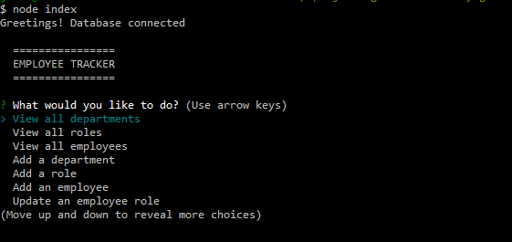
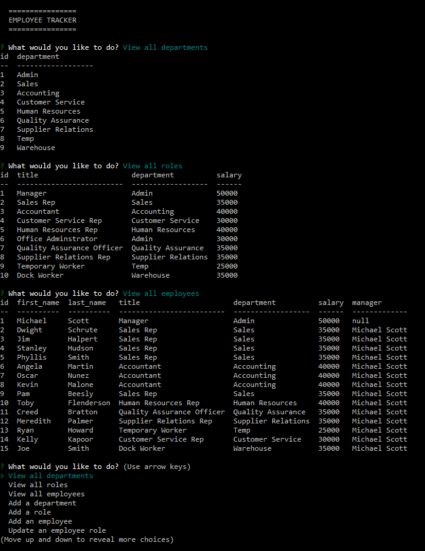

# Employee Tracker

## Purpose
CLI that allows the user to access a database to keep track of Department, Role, and Employee information. New entries can be made for each of these areas, as well as the ability to update an employee's role in the company.

## Built With
* JavaScript
* mysql2 (npm)
* inquirer (npm)
* console.table (npm)

## Demonstration Video Link
https://watch.screencastify.com/v/mULloUSCI9Mldyh5kXbZ

## App Previews

